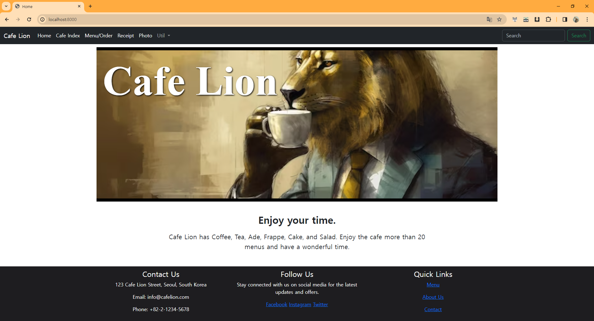
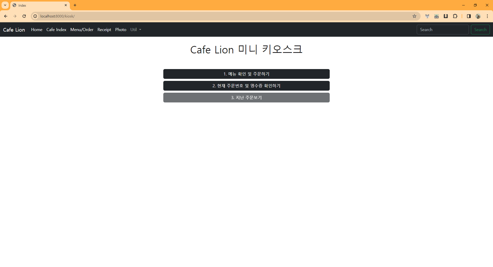
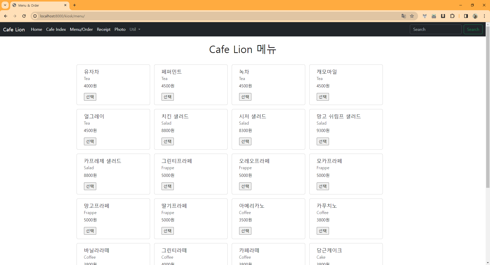
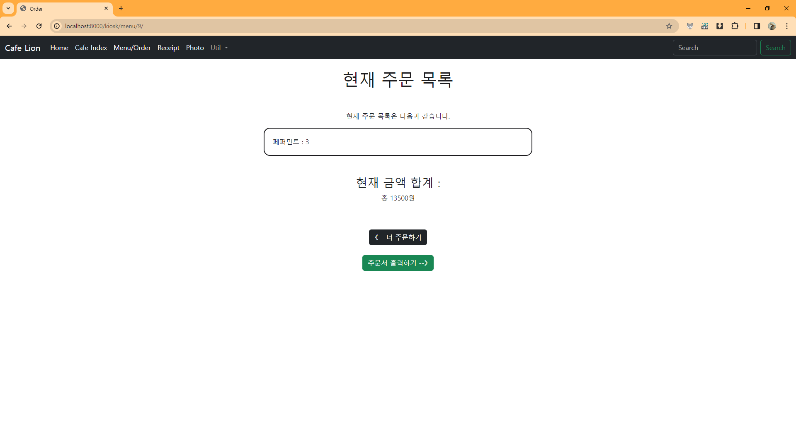
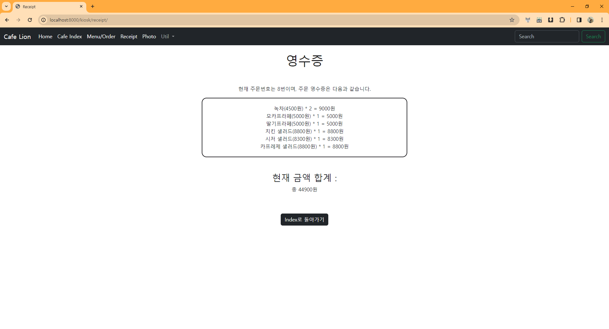

## 프로젝트 3.0.0

메뉴 페이지에서 바로바로 장바구니를 확인할 수 있게 하였고, 로그인 기능을 추가하였다.

손님은 로그인이 없어도 주문할 수 있지만, 가게 주인은 로그인을 필요로 하며 로그인 시 메뉴 추가 및 삭제를 할 수 있다.

## 프로젝트 2.1.0

카페 메뉴 주문 및 현재 주문의 영수증을 확인하는 기능을 추가했다.

**영수증 출력하기** 버튼을 누르면 새 주문을 받을 수 있으며, 그러면 기존의 영수증은 더 이상 확인할 수 없고 현재의 주문 영수증으로 뒤덮여진다.

시간과 order_id에 따른 영수증 조회를 구현하고자 했으나 시간이 모자랐다.

중간에 Dbeaver에서 테이블을 지웠으나 이러한 삭제는 Django에서는 반영이 되지 않는다는 걸 깨달았고, migrate를 초기화하느라 시간이 꽤 걸렸다.

## Home 페이지

## Index 페이지

## 메뉴 확인

## 주문

## 영수증 확인

 
 
 # ★★프로젝트 대거 수정 Ver 2.0.0

 본래는 로그인 기능과 회원 가입 기능, 그리고 손님에 따른 영수증을 출력하려고 하였으나 로그인 및 회원가입 기능과 손님에 따른 메뉴 분류에 의한 구현 난이도가 상승하여, 난항을 겪어 기본 Basic에 충실하기로 했다.

 일단 기본 기능을 구현한 후, 가능하다면 추가 기능을 구현하는 식으로 프로젝트를 마무리 하고자 한다.

 1. Customer 관련된 기능을 전부 제외하고 단순하게 Question-Choice Poll과 같이 주문하면 메뉴의 count가 상승하도록 한다. 이때 Order 테이블에는 Menu 테이블과 동일한 메뉴들을 넣어놓고, 주문하면 그 메뉴들의 count가 상승하는 식으로 한다. 차후 count가 0인 건 출력하지 않는다.

 2. 주문을 완료하면 최종 영수증을 보여주는 기능을 추가한다.

 3. 신규 주문 기능을 추가하여, 신규 주문을 할 경우 기존 주문은 Order를 모아놓는 테이블에 저장하고, 장바구니를 비운 뒤 새로운 Order_id를 부여하여 주문한다.

 4. 이렇게 모아진 Order들을 Order_id별, 날짜별로 조회하는 기능을 추가한다.

 
 

 ## 페이지 구조
📦HOME (카페 메인 페이지) + Bootstrap을 이용한 Nav  
 ┣ 📂Kiosk/Index 
 ┃ ┣ 📜메뉴 확인 
 ┃ ┃ ┣ 📋주문하기(count 상승) 
 ┃ ┣ 📜영수증 출력(현재 주문 확인) 
 ┃ ┣ 📜지난 영수증 출력 
 ┃ ┃ ┣ 📋영수증 ID로 출력하기 
 ┃ ┃ ┗ 📋주문 날짜로 출력하기 
 ┃ ┗ 📜신규 주문 
 ┗ 📂Admin 

 

# mini_kiosk Ver 1.0.0

해당 프로젝트는 카페의 미니 키오스크를 구현하고자 한다.

DB는 음료 데이터를 담고 있는 ``Menu``와 주문 데이터를 담고 있는 ``Order``, 그리고 손님 데이터를 담고 있는 ``Customer``로 이루어져 있다.

## 관계도

## Menu

``Menu`` 테이블은 ``menu_name``, ``menu_price``, ``menu_category`` 컬럼으로 이루어져 있다.

``menu_name``에는 문자형으로 메뉴 이름이 들어가며, ``menu_price``는 정수형으로 해당 메뉴의 가격, ``menu_category``는 문자형으로 메뉴의 분류를 담고 있다.

## Customer

``Customer`` 테이블은 ``customer_name``, ``order_type`` 컬럼으로 이루어져 있다.

``customer_name``에는 문자형으로 고객 이름이 들어가며, ``order_type``에는 문자형으로 결제 방식이 들어간다.

## Order

``Order`` 테이블은 ``order_date``와 함께 외래키로 ``customer_id``, ``menu_id``를 가진다.

``order_date``에는 날짜형으로 주문한 시각이 들어가며, ``customer_id``는 어떤 고객이 주문했는지, ``menu_id``는 어떤 메뉴를 주문했는지 외래키로 작성한다.

## Current_Customer

현재 주문을 하고 있는 손님이 누구인지 나타내는 DB.

## 페이지 구조
📦HOME (사용자 정보 로그인) 
 ┣ 📂로그인 
 ┃ ┣ 📜메뉴 보기 
 ┃ ┃ ┣ 📋주문하기(메뉴 선택) 
 ┃ ┃ ┃ ┗ 💵결제 방법 선택 
 ┃ ┃ ┗ 📋메뉴 카테고리별 확인하기 
 ┃ ┣ 📜영수증 출력(현재 주문 확인) 
 ┃ ┣ 📜지난 영수증 출력 
 ┃ ┃ ┣ 📋영수증 ID로 출력하기 
 ┃ ┃ ┗ 📋주문 날짜로 출력하기 
 ┃ ┗ 📜로그아웃(HOME으로 돌아가기) 
 ┗ 📂회원가입 
 

 
 ## 구현 목표
 HOME 화면에서 로그인 페이지 구현 -> Current Customer에 입력하기
 로그인 데이터가 Customer 테이블에 있는 데이터인지 확인하기
 회원가입 페이지를 통해 DB에 Customer 데이터를 입력하기

 메뉴 확인 -> 주문하기 -> 메뉴를 고르면 최종 가격 띄우기
 음식의 카테고리 별로 메뉴판을 볼 수 있도록 하기
 현재 주문 테이블을 통해 영수증 출력하기

 Order id를 통해 다른 주문을 검색하고, 날짜별 주문을 확인할 수 있도록 하기
 

 뒤로가기 버튼 구현

 Customer 테이블을 id와 비밀번호로 변경하고, 결제 방법은 Order 테이블에 추가하기