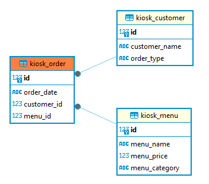

# mini_kiosk

해당 프로젝트는 카페의 미니 키오스크를 구현하고자 한다.

DB는 음료 데이터를 담고 있는 ``Menu``와 주문 데이터를 담고 있는 ``Order``, 그리고 손님 데이터를 담고 있는 ``Customer``로 이루어져 있다.

## 관계도

## Menu

``Menu`` 테이블은 ``menu_name``, ``menu_price``, ``menu_category`` 컬럼으로 이루어져 있다.

``menu_name``에는 문자형으로 메뉴 이름이 들어가며, ``menu_price``는 정수형으로 해당 메뉴의 가격, ``menu_category``는 문자형으로 메뉴의 분류를 담고 있다.

## Customer

``Customer`` 테이블은 ``customer_name``, ``order_type`` 컬럼으로 이루어져 있다.

``customer_name``에는 문자형으로 고객 이름이 들어가며, ``order_type``에는 문자형으로 결제 방식이 들어간다.

## Order

``Order`` 테이블은 ``order_date``와 함께 외래키로 ``customer_id``, ``menu_id``를 가진다.

``order_date``에는 날짜형으로 주문한 시각이 들어가며, ``customer_id``는 어떤 고객이 주문했는지, ``menu_id``는 어떤 메뉴를 주문했는지 외래키로 작성한다.

## Current_Customer

현재 주문을 하고 있는 손님이 누구인지 나타내는 DB.

## 페이지 구조
📦HOME (사용자 정보 로그인)
 ┣ 📂로그인
 ┃ ┣ 📜메뉴 보기
 ┃ ┃ ┣ 📋주문하기(메뉴 선택)
 ┃ ┃ ┃ ┗ 💵결제 방법 선택
 ┃ ┃ ┗ 📋메뉴 카테고리별 확인하기
 ┃ ┣ 📜영수증 출력(현재 주문 확인)
 ┃ ┣ 📜지난 영수증 출력
 ┃ ┃ ┣ 📋영수증 ID로 출력하기
 ┃ ┃ ┗ 📋주문 날짜로 출력하기
 ┃ ┗ 📜로그아웃(HOME으로 돌아가기)
 ┗ 📂회원가입

 
 ## 구현 목표
 HOME 화면에서 로그인 페이지 구현 -> Current Customer에 입력하기
 로그인 데이터가 Customer 테이블에 있는 데이터인지 확인하기
 회원가입 페이지를 통해 DB에 Customer 데이터를 입력하기

 메뉴 확인 -> 주문하기 -> 메뉴를 고르면 최종 가격 띄우기
 음식의 카테고리 별로 메뉴판을 볼 수 있도록 하기
 현재 주문 테이블을 통해 영수증 출력하기

 Order id를 통해 다른 주문을 검색하고, 날짜별 주문을 확인할 수 있도록 하기
 

 뒤로가기 버튼 구현

 Customer 테이블을 id와 비밀번호로 변경하고, 결제 방법은 Order 테이블에 추가하기